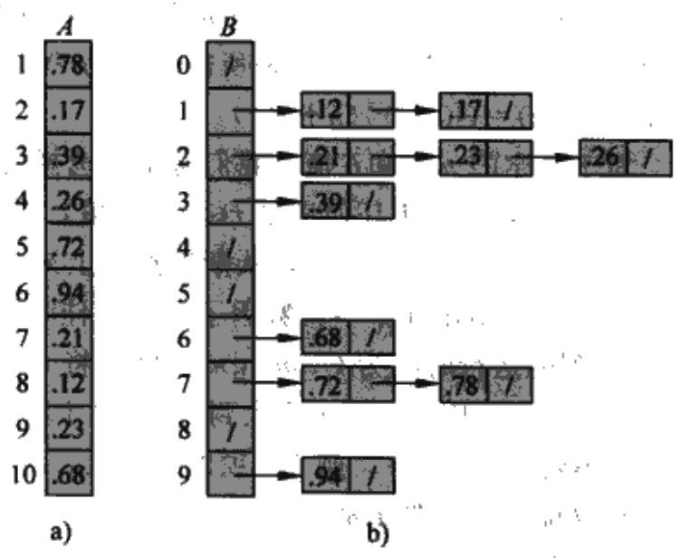

##Bucket Sort
---
Bucket sort is:

* an ideal choice for sorting numbers in a small range. 
* O(n + m), where n is the number of items and m is the number of distinct items.
* stable performance, faster than quick sort in many circumstances, but it  will use a lot of space.


The thought of bucket sort is partition the array into a finite number of buckets, and then sort each bucket individually. 

The picture below is from "Introduction to Algorithm", it shows the process of bucket sort.



C++ code for memo:

```
template<typename Type>
void bucketsort(Type *arr, const int len) {
	Position head_list[len]; // = new Node();
	for (int i = 0; i < len; ++i) {
		head_list[i] = new Node();
	}
	for (int i = 0; i < len; ++i) {
		insert(head_list[arr[i] / 10], arr[i]);
		if (DEBUG - 1) {
			cout << "list: " << arr[i] / 10 << " "
					<< head_list[arr[i] / 10]->next->data << endl;
		}
	}
	Position pos = new Node();
	int j=0;
	for (int i = 0; i < len; ++i) {
		pos = head_list[i];
		while (pos->next != NULL) {
			pos = pos->next;
			arr[j++] = pos->data;
		}
	}
}

template<typename Type>
void insert(Position pos, const Type data) {
	Position node = pos;
	if (node->next == NULL) {
		Position newnode = new Node();
		newnode->data = data;
		newnode->next = NULL;
		node->next = newnode;
		return;
	} else {
		while (node->next != NULL) {
			if (node->next->data >= data) {
				Position newnode = new Node();
				newnode->data = data;
				newnode->next = node->next;
				node->next = newnode;
				return;
			}
			node = node->next;
		}
		if (node->next == NULL) {
			Position newnode = new Node();
			newnode->data = data;
			newnode->next = NULL;
			node->next = newnode;
			return;
		}
	}
}
```
